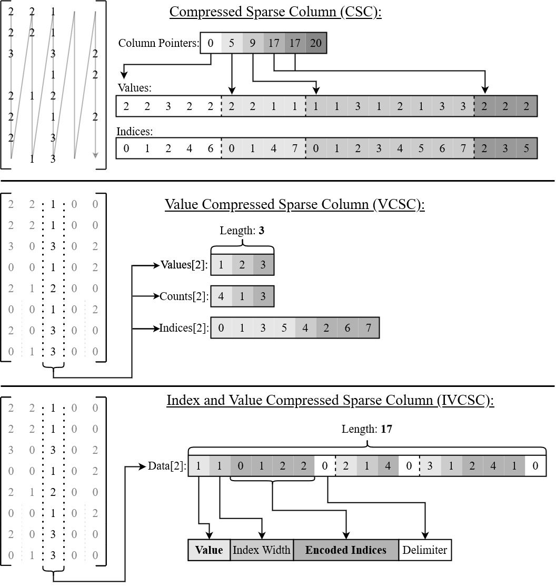

# IVSparse Library

The IVSparse Library is a C++ sparse matrix library optimized for the compression of sparse data in cases where non-zero values are highly redundant. IVSparse supports three main compression formats. 

* The first format is Compressed Sparse Column (CSC), an industry standard for compressing and using sparse data, but not specialized for the compression of redundant data. The other two are novel formats which build upon the CSC format for the compression of redundant sparse data.
* The second format modifies the CSC format by adding value compression to get Value Compressed Sparse Column (VCSC). This format compresses the value data of a matrix by only storing a unique value in a column once, meaning repeated values in a column only increase the size of index data. 
  * ~2.25x fold compression over CSC  (*for redundant data*)
* Next by adding index compression to VCSC we get Index and Value Compressed Sparse Column (IVCSC). This format takes the advantages of value compression and adds on compression of indices by positive-delta encoding the indices for unique values and then byte-packing them. 
  * ~7.5x fold compression over CSC (*for redundant data*)

The details of the three formats can seen in the following image:

## Random Access is Unordered

For the two new formats (VCSC and IVCSC) random access is unordered. Where CSC orders its values first by column and then by row index, VCSC and IVCSC order their values firstly by value and secondly by row index. This means the access of values in a column is not guaranteed to be in order. This is a trade-off for the compression of the data, providing low memory footprint and still fast sparse-dense operations at the cost of traversability.

## C++ API

The `IVSparse::SparseMatrix<T_val, T_idx, comp_level, storage_order>` class is similar to the `Eigen::SparseMatrix<T_val, T_idx>` class in both the syntax and functionality. The `comp_level` template parameter for IVSparse takes an integer {1, 2, 3} where 1 is CSC, 2 is VCSC, and 3 is IVCSC. Use CSC for data that is small, non-redundant, or performing sparse-sparse operations. Use VCSC for data that is redundant and large but still requires performant procedures for sparse-dense operations, or if unsure which format to use and CSC is too large. IVCSC should then be used for data that is highly redundant and/or very large, and if a compromised random-access is acceptable for a steep reduction in memory footprint.

Documentation for the API can be found [here](https://seth-wolfgang.github.io/IVSparse/).